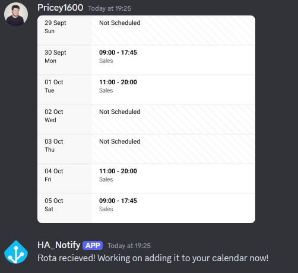
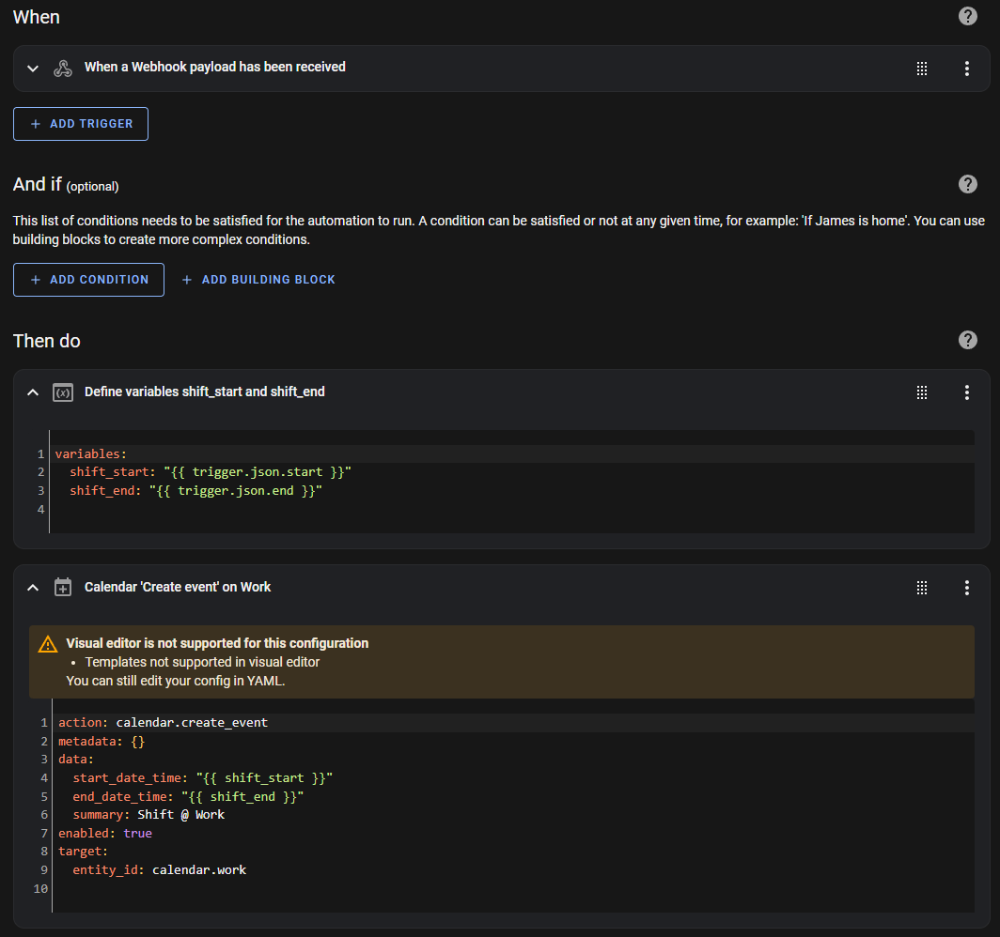
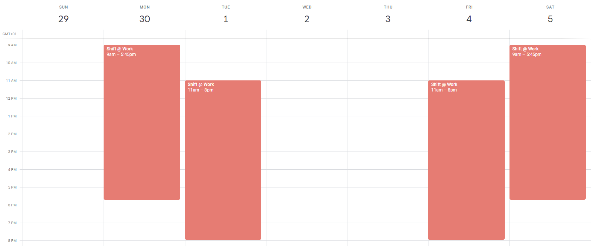

# Home Assistant Discord Bot
This Discord bot for Home Assistant allows a screenshot of a weekly work rota to be send via a specific text channel on Disocrd. It is then downloaded and analysed by Tesseract-OCR to extract shift dates and times that can be send to Home Assistant via a webhook for use in automations and to be added to a Google calendar.

This was created due to the app my employer uses to manage rotas being unreliable, slow and losing functionality. For example, the 'add to calendar' feature of the app used to add a week's shifts to your phone's local calendar (where it could not be synced accross devices) but now that feature simply does not work anymore. As there is no open api (that I could find) I settled on the next best thing; using the still working (for now) 'share screenshot' button to get my shifts out of the app and into my Home Assistant instance. This beats having to manually enter shifts into my calendar every week.

In my personal set-up this is running in a Docker container on a small home server; allowing dependencies and packages to be installed automatically. However, the OCR training data does cause the image size to push above 1GB.

NOTE: The Home Assistant webhook URL exists on the first line of a local, non-tracked file called 'secrets.txt' and the bot token exists on the second line of the same file.

